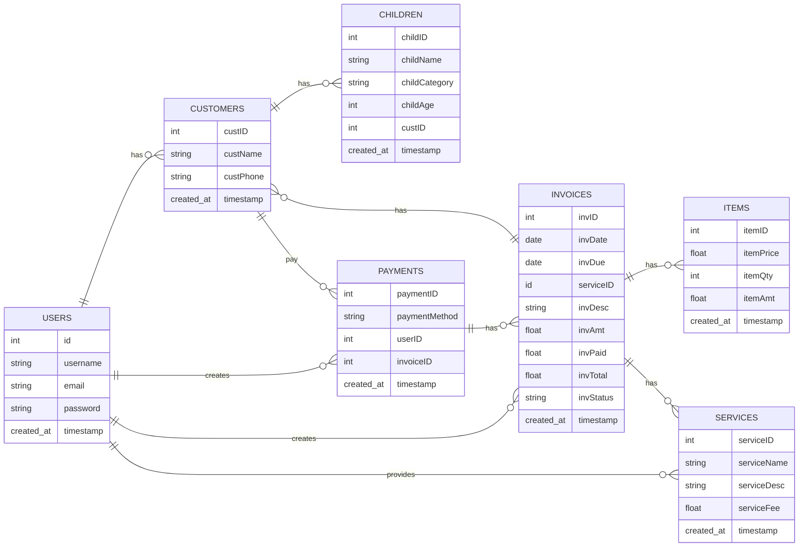

# Van Cik Lin Invoicing-System

A web based invoicing and payment tracking system built using **Python Flask** and **MySQL** for a small school van service.

This project was developed as a **personal learning project** to explore web development with Python while solving a real-world problem for my mom's school van service business.

## Project Overview

This project helps manage:
- Customer information
- Invoice records
- Payment tracking
- Basic business insight through a visualization dashboard

Previously, all records were manage manually. This system aims to improve ogranization, reduce errors, and provide clearer visibility of monthly payments and outstanding balances.

---

## ERD Diagram

## Tech Stack

- **Backend**: Python Flask
- **Database**: MySQL (mysqldb)
- **Frontend**: HTML, CSS, JavaScript
- **Charting**: Chart.js

## Key Features

- **User Authentication**: Secure login and registration
- **Invoice Management**: Create, view, and manage invoices
- **Payment Tracking**: Track payments and outstanding balances
- **Dashboard**: Visualize key metrics and trends

