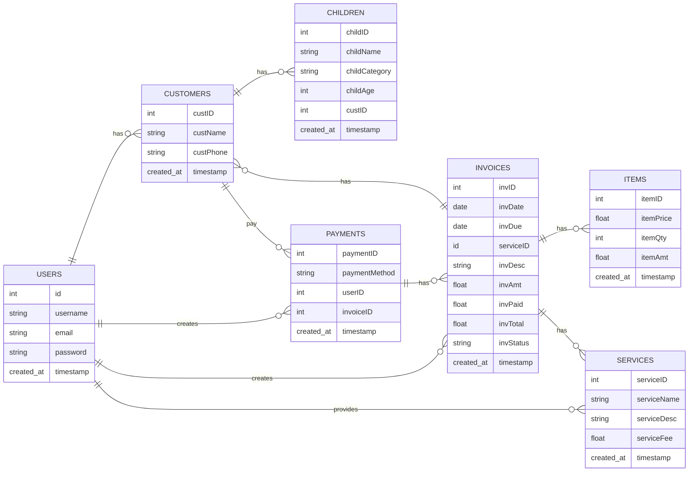

# Van Cik Lin Invoicing-System
Van Cik Lin Invoicing System

ERD Diagram

```mermaid
erDiagram
	direction LR
	USERS{
		int id  ""  
		string username  ""  
		string email  ""  
		string password  ""  
		created_at timestamp  ""  
	}

	CUSTOMERS {
		int custID  ""  
		string custName  ""  
		string custPhone  ""  
		created_at timestamp  ""  
	}

    CHILDREN{
        int childID
        string childName
        string childCategory 
        int childAge
        int custID
        created_at timestamp
    }

	SERVICES {
		int serviceID  ""  
		string serviceName  ""  
		string serviceDesc  ""  
		float serviceFee  ""  
		created_at timestamp  ""  
	}

	INVOICES {
		int invID  ""  
		date invDate  ""  
		date invDue  ""  
		id serviceID  ""  
		string invDesc  ""  
		float invAmt  ""  
		float invPaid  ""  
		float invTotal  ""  
		string invStatus  ""  
		created_at timestamp  ""  
	}

	ITEMS {
		int itemID  ""  
		float itemPrice  ""  
		int itemQty  ""  
		float itemAmt  ""  
		created_at timestamp  ""  
	}

	PAYMENTS {
		int paymentID  ""  
		string paymentMethod  ""  
		int userID  ""  
		int invoiceID  ""  
		created_at timestamp  ""  
	}

	USERS||--o{CUSTOMERS:"has"
	USERS||--o{SERVICES:"provides"
	USERS||--o{INVOICES:"creates"
	INVOICES||--o{ITEMS:"has"
	INVOICES||--o{SERVICES:"has"
	INVOICES||--o{CUSTOMERS:"has"
	USERS||--o{PAYMENTS:"creates"
	PAYMENTS||--o{INVOICES:"has"
	CUSTOMERS||--o{PAYMENTS:"pay"
    CUSTOMERS ||--o{ CHILDREN: "has"
```
